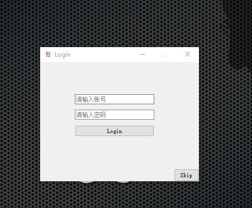
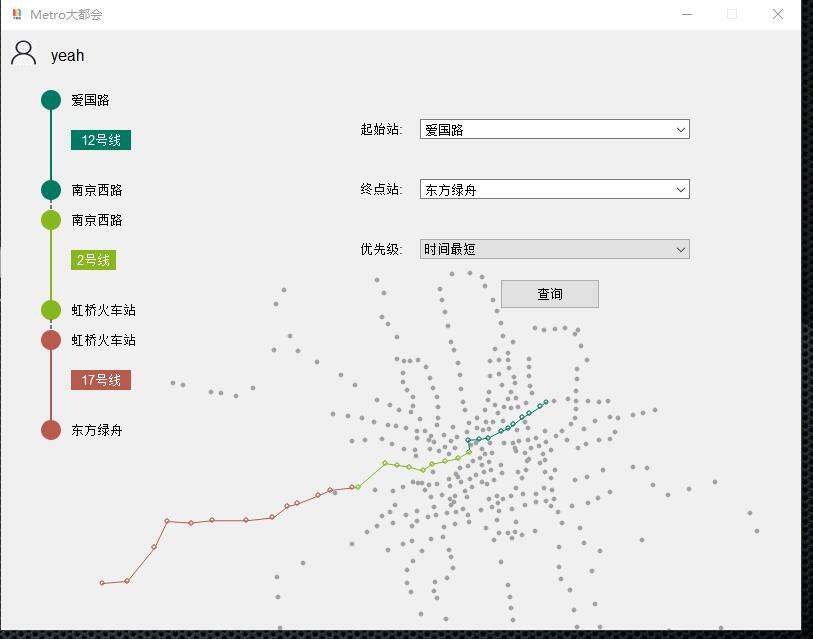
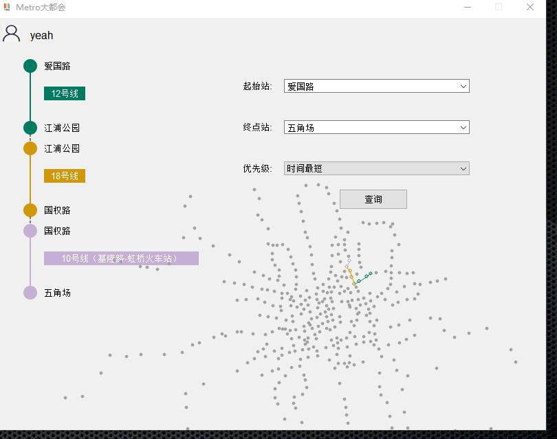
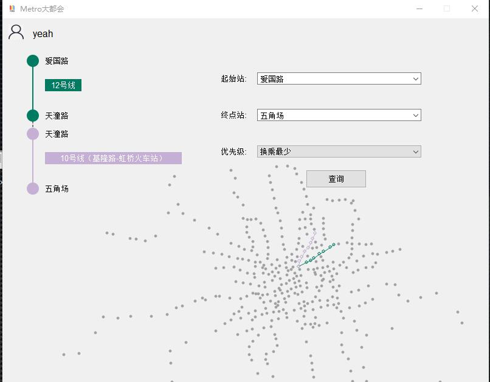

## 基于Qt5的上海地铁Metro换乘系统

> Tips:
> 1. 地铁文件（city/shanghai.txt）信息在utils.cpp 文件中，需要更改为你自己设备上的地址
> 2. 数据库文件（metro.db）信息在maincontroller.cpp文件中，同样需要更改为你自己设备上的地址
> 3. exe文件夹中的exe文件可直接下载运行，无需额外安装环境 (默认账号:yeah 密码:123) 也可以直接跳过

### 主要内容

- 交互界面由Qt5编写，地图绘制采用QPainter；
- 多特征最短路采用堆优化版本Dijkstra来高效实现；
-  数据库采用SQLite；

### 参考文献

https://github.com/lankoestee/MetroSearch 

https://www.acwing.com/problem/content/1626/

